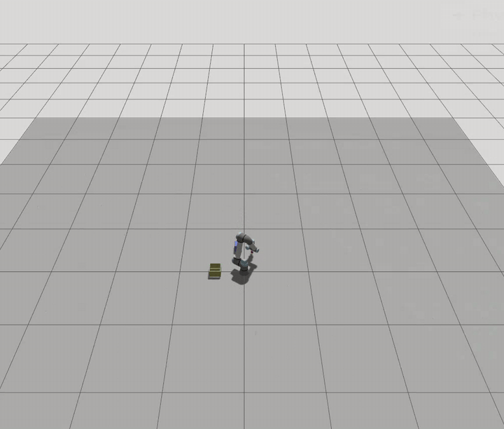
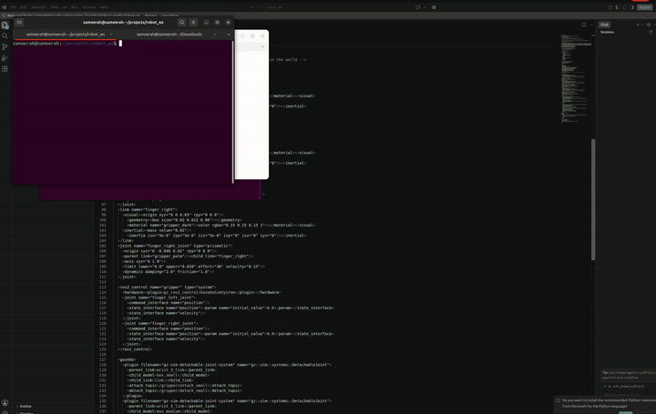
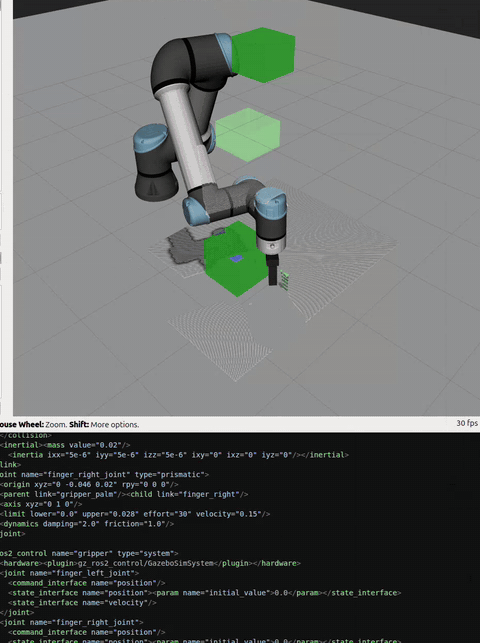

# ur5e-box-sorter

Vision-guided, collision-aware pick-and-place sorting with a UR5e in Gazebo
Harmonic (ROS 2 Jazzy). An overhead RGB-D camera watches a table of boxes. The
robot measures each box, decides which fit its 80 mm gripper, publishes every
box into MoveIt's planning scene as a collision object, plans around the ones
in its way, picks the graspable ones with an adaptive two-finger gripper, and
places them in a container — re-scanning the scene before every pick. No box
positions, sizes, or layouts are hardcoded: `--shuffle` scatters the boxes
randomly and the mission still completes; `--roadblock` parks the oversized
box in the approach corridor and the planner detours around it.

## Demo

**v1 — first complete mission (magic-hand hold) — ✅ retired milestone.**
Historical recording; the magic-hand code no longer exists in the repo.



**v2 — custom adaptive gripper + weld-based hold.** This behavior is today's
default mission:

    bash start_robot.sh
    ros2 run ur_box_sorter sort_boxes



**v3 — collision-aware planning with the live 3D reconstruction view.**
Gazebo (the world) beside RViz (the robot, the planner's green collision
blocks, and the camera's colored point cloud). One command opens all windows;
the adversarial run parks the oversized box in the corridor:

    bash start_robot.sh
    ros2 run ur_box_sorter sort_boxes --roadblock     # or: --shuffle



v3 mission log (roadblock run):

```
ROADBLOCK: big blue box parked in the approach corridor (0.51,-0.10)
  [scene] 3 obstacles live in planner
see 3 boxes: 2 graspable, 1 too big
  skipping 0.120 m box at (+0.51,-0.10) — wider than gripper
--> picking box_small (0.040 m) at (+0.40,-0.12)  [rescanned]
    fingers closed to 0.041 m gap
    WELDED box_small to hand
    released box_small — dropped into container
  [scene] 2 obstacles live in planner
--> picking box_medium (0.060 m) at (+0.62,-0.08)  [rescanned]
    fingers closed to 0.061 m gap
    WELDED box_medium to hand
    released box_medium — dropped into container
  [scene] 1 obstacles live in planner
no graspable boxes remain — wrapping up
MISSION COMPLETE (MoveIt + collision-aware): 2 boxes sorted;
planner avoided every published obstacle
```

## How it works

1. **Perceive** — `/rgbd/points`: auto-detect the depth axis, remove the ground
   plane, split the remaining points into boxes via 1 cm-grid
   connected-components clustering; per box: footprint (both dims), height,
   center, converted to the robot frame. A fresh scan runs before every pick;
   the mission ends when a scan finds nothing graspable.
2. **Model** — every perceived box is published into MoveIt's planning scene as
   a collision object (plus the container walls and the camera rig). The target
   box is removed from the scene at commit time — a goal, not an obstacle — and
   the box set is cleared for the high carry phase, then republished by the
   next scan.
3. **Plan** — hybrid goal generation, a common production pattern: an analytic
   damped-least-squares IK (written from the published UR5e DH parameters,
   verified against the sim to < 1 mm) computes exact joint-space goals with a
   tool-down constraint; MoveIt (OMPL) plans, validates, and executes the path
   through the standard scaled trajectory controller, detouring around scene
   obstacles. Joint-space goals sidestep the nondeterministic
   constraint-sampler entirely.
4. **Grip** — a custom two-finger gripper added to the UR5e by
   robot-description surgery (`ur5e_gripper.urdf.xacro` wraps the shipped
   description; no upstream files touched). Prismatic fingers under a position
   controller close to the width perception measured — adaptive, per box.
5. **Hold** — a Gazebo detachable joint welds the box to the wrist: rigid,
   zero-slip carry; released above the container, the box drops in by gravity.
6. **Resolve** — box identities (for the weld topics) come from live model-pose
   queries at scan time, not a stored map; shuffled layouts resolve correctly.

## Run

Prereqs: Ubuntu 24.04, ROS 2 Jazzy, Gazebo Harmonic, `ros-jazzy-ur-simulation-gz`,
`ros-jazzy-ur-moveit-config`, `ros-jazzy-ur-robot-driver`, `ros-jazzy-ros-gz`.

    colcon build --packages-select ur_box_sorter && source install/setup.bash
    bash start_robot.sh     # gates: EGL fix, controllers, gripper, MoveIt, camera, TF
    ros2 run ur_box_sorter sort_boxes               # standard mission
    ros2 run ur_box_sorter sort_boxes --shuffle     # random layout first
    ros2 run ur_box_sorter sort_boxes --roadblock   # obstacle in the corridor

`start_robot.sh` refuses to hand over a half-alive robot: every stage is gated
(controllers up, MoveIt's `/move_action` live, `/rgbd/points` actually
streaming) and it publishes the camera's TF so the point cloud renders in the
MoveIt RViz window next to the planning scene.

## Layout

    ur_sensor_world.sdf           scene: boxes (with friction), container, camera
    ur5e_gripper.urdf.xacro       UR5e + gripper + weld plugins + contact pads
    ur_gripper_controllers.yaml   arm + gripper controllers (sim-tuned tolerances)
    start_robot.sh / stop_robot.sh   gated bring-up / teardown
    src/ur_box_sorter/            sort_boxes (mission), measure_boxes, wave_ur

## Roadmap

- [x] v1 — full see → decide → pick → place mission (magic-hand hold)
- [x] Custom two-finger gripper via URDF/xacro, adaptive close-to-width
- [x] Rigid weld-based hold (detachable joint) — zero-slip carry
- [x] Smooth motion — MoveIt-planned trajectories (earlier: blended multi-point
      splines with waypoint velocities)
- [x] Re-scan between picks + randomized scenes (`--shuffle`) — no hardcoded
      layout survives anywhere in the code
- [x] MoveIt collision-aware planning — perception-fed planning scene,
      obstacle detours proven under the `--roadblock` adversarial test
- [ ] True contact-physics grasping — **attempted and parked**: collision pads
      verified present in the robot description (MoveIt sees and uses them),
      but the dartsim physics side never registers them; a physics-engine swap
      (bullet-featherstone) is the queued next experiment. Field notes below.

## Field notes

- RTX 5090 (Blackwell) + mesa EGL: sensor rendering crashes/hangs
  (`egl: failed to create dri2 screen`). Fix: route EGL to the NVIDIA
  implementation via `__EGL_VENDOR_LIBRARY_FILENAMES` (baked into start script).
- A colon inside an XML comment killed the robot: xacro preserves comments,
  the launch stack YAML-scans `robot_description`, and `": "` in a comment
  raises a ScannerError. Keep `": "` out of xacro comments.
- Fixed-joint lumping: Gazebo merges fixed-joint links into their parent; a
  detachable joint's `parent_link` must name the surviving link.
- Negative prismatic axes misbehave (`-0.0000`, never tracks). Rotate the
  joint frame 180° and keep the axis positive.
- MoveIt on a custom description: launch it description-over-topic and it
  inherits your modified robot for free (stock SRDF mismatch is tolerated;
  extra joints ride as passive).
- The TF tree splits: MoveIt's planning frame here is `base_link`, not
  `world` — pose goals aimed at a frame TF can't resolve fail as generic
  planning errors (99999).
- MoveIt's pose-goal constraint sampler is nondeterministic; identical goals
  can pass then fail. Exact joint-space goals from a verified analytic IK
  eliminate the roulette (hybrid pattern).
- Sim controllers ship real-robot path-tolerance watchdogs
  (`PATH_TOLERANCE_VIOLATED` at 0.2003 rad vs 0.2000 allowed). Disable
  trajectory constraints in the sim controller config.
- Margin-zero starts: after executing to a goal sampled a hair from a padded
  obstacle, the *next* plan can fail with START_STATE_IN_COLLISION (-10).
  During the high carry phase, clear the (physically unreachable) box
  obstacles; the next scan restores them.
- The ghost fingers: collision pads present and correct in the expanded URDF
  and the live `/robot_description` — and never felt by dartsim physics
  (fingers pass through boxes; dartsim also logs `collision ... couldn't be
  created` for every arm mesh). Unresolved on this stack; bullet-featherstone
  swap queued. Three CLI probes lied along the way (latched-topic QoS,
  128-char echo truncation, line-vs-occurrence grep) — verify your probes
  before trusting their zeros.
